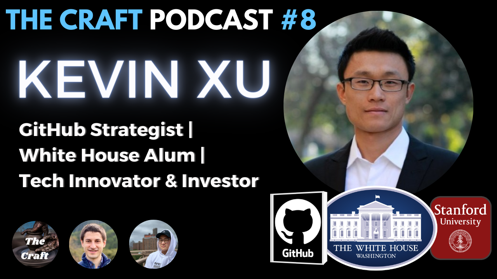

## Short Summary

Kevin Xu, technology strategist, investor, and founder of the newsletter Interconnected, joins The Craft Podcast. Kevin shares his diverse career background spanning open-source technology, politics, and his time at the White House, GitHub, PingCAP. We explore how he cultivates his curiosity and drive for continuous exploration, covering everything from career transitions, embracing challenges, how his newsletter Interconnected was born, his plans for Interconnected 2.0, and his thoughts on the role of AI in content creation.

## Summary

Kevin Xu, founder of Interconnected and a technology strategist and investor, reflects on his career journey in the Craft Podcast. Brought up mainly by a single mother, Kevin's freedom to learn nurtured his learning passion. He worked in renowned institutions like GitHub, Pink Hat, and the White House and transitioned between politics and the tech industry, driven by curiosity and the thrill of challenging himself in new fields. Inspired by the TV show "The West Wing" and Obama's presidential campaign, Kevin initially pursued a career in politics, before switching over to the booming tech industry. Stanford law school sparked his interest in technology where he learned to code. He later founded a newsletter focusing on the intersection of technology, business, and geopolitics, reflecting his unique background. Kevin's rich experiences, fuelled by his voracious reading habits, allow him to consistently generate fresh content for his newsletter. Career lows include a stint as a chatbot company founder, where technical challenges and his self-acknowledged lack of focus led to a painful exit. Kevin also discussed plans for a paid version of his interconnected newsletter, his investment partnership, and the limitless potential of public market investing. The speakers also debate the balance between natural abilities and honed skills in shaping one's career. Finally, the potential of AI in content creation, the process of writing, and Kevin's future content plans were discussed. Despite pondering a podcast, Kevin considers writing as a practice that amplifies his strength.

## Chapters

0.00 Introduction and Background
3:50 Switching Careers and Life as a Game
11:30 Implementing Skills in Different Fields
16:50 Education and Starting a Newsletter
21:50 Connections in China and Tech
26:30 Interconnected 2.0
32:00 Failing and Recovering
42:00 AI in Writing and Podcasts

## Conversation Guide

These notes are to guide the conversation. We’ll focus on these topic areas and prioritize the _italicized questions_, but we won’t ask each question like a Q&A. We’ll have a human conversation and skip or go deep based on (1) our own curiosity, (2) whatever you would like to share, and (3) our time limitations.

### Welcome :00 - :05

[Dan] Welcome to The Craft podcast, where we interview experts in various fields to learn about their disciplines and how they strive towards mastery. We love talking to people who are passionate enough to master something. We have each been asking curious questions of these craftspeople our whole lives, and want to share those conversations with others. Let’s get right into it.

[Michael] Our guest today is Kevin Xu. He's a technology strategist, investor, and founder of Interconnected, a popular newsletter that examines the intersections of tech, business, geopolitics, and US-Asia relations. Kevin's expertise spans various sectors including open source technology, AI, and blockchain. He has served in roles at GitHub, PingCAP, and the Obama White House. His insights into US-China tech dynamics are sought after by major media outlets. We’re thrilled to have Kevin on the show. Kevin, welcome to The Craft Podcast.

### Origins [Dan] -- :05 - :20

- You have a wide range of interests and you pursue them with excellence. _Were there any indications that young Kevin would grow up to do a wide variety of things instead of just being an expert in a single area?_
- What drives you to work? How did your childhood shape that part of you?
- You decided to pick up a computer science master's degree _during_ law school and _without_ a background in computer science. How on Earth did you come to that decision?

### Tech & China [Michael] -- :20 - :35

- _How did you come up with Interconnected? What was going on in your life that led you to start it?_
- What's the best insight you've had about the China tech scene? How did it come to you? What's your process for coming up with and writing new things?
- How do you stay up to date with the China tech scene when you're not in the country?

### Content Creation [Dan] -- :35 - :50

- Let's talk about your less successful or fulfilling content creation ventures. What has been a flub? How have you recovered?
- _Have you ever wanted to quit the newsletter? What kept you going?_
- What's the boldest topic you've addressed that makes you most proud?
- _Why should a newsletter and investing go together? How did you come up with that?_

### Wrap Up [Michael] -- :50 - 1:00

- Given your wide array of interests, how do you stay focused when pursuing mastery?
- We've covered so much in this interview. What else would you like to share or what key takeaways would you highlight for our listeners? _How should folks follow you to hear about what you’re up to?_

[Dan] Our guest today has been Kevin Xu. Kevin, thanks for being part of The Craft. Thank you for listening to The Craft podcast. If you like  our interviews, please, please subscribe and give us a thumbs up. That's the best way to tell the platforms that we're making good content. For more links and information about this episode, or to listen to more episodes you can search for The Craft Podcast by Daniel Tedesco and Michael Du on YouTube or anywhere you get your podcasts. See you next time and–until then–keep crafting.

## Thumbnail for YouTube

## Meeting Logistics

Daniel Tedesco is inviting you to a scheduled Zoom meeting.

[Join Zoom Meeting](https://us06web.zoom.us/j/86908662336)

Meeting ID: 869 0866 2336

---

One tap mobile
+17207072699,,86908662336# US (Denver)
+12532050468,,86908662336# US

---

Dial by your location
• +1 720 707 2699 US (Denver)
• +1 253 205 0468 US
• +1 253 215 8782 US (Tacoma)
• +1 301 715 8592 US (Washington DC)
• +1 305 224 1968 US
• +1 309 205 3325 US
• +1 312 626 6799 US (Chicago)
• +1 346 248 7799 US (Houston)
• +1 360 209 5623 US
• +1 386 347 5053 US
• +1 507 473 4847 US
• +1 564 217 2000 US
• +1 646 558 8656 US (New York)
• +1 646 931 3860 US
• +1 669 444 9171 US
• +1 689 278 1000 US
• +1 719 359 4580 US

Meeting ID: 869 0866 2336

[Find your local number](https://us06web.zoom.us/u/keCWXgB9Gt)

## Draft Social Media Posts

### Twitter

🎙 Excited to welcome another polymath guest Kevin Xu (@kevinsxu) to The Craft podcast! Dive into the intersections of tech, business, geopolitics, and US-Asia relations. From his experiences at GitHub to the Obama White House, Kevin has a lot to share. Tune in on YouTube or wherever you get your podcasts. https://www.youtube.com/@thecraftpodcast

### LinkedIn

I'm thrilled to announce our next guest on The Craft podcast, Kevin Xu. Kevin is a technology strategist, founder of the US-China tech and business newsletter, Interconnected. Another polymath guest, Kevin has worked with organizations as varied as GitHub, PingCap, and the Obama White House.

Our conversation will explore how he's mastered the variety of crafts he takes on. Whether you're interested in open-source technology, AI, or the dynamics of the China tech scene, this episode promises deep insights and engaging discussion.

Join us on Sunday October 29, 2023. Listen to The Craft Podcast by Daniel Tedesco and Michael Du on on YouTube or wherever you get your podcasts. https://www.youtube.com/@thecraftpodcast

## Background

### Kevin's Twitter Bio

Building/Investing @ Interconnected Capital; Writing @interconnect_ed; ex. GitHub, PingCAP, Obama White House/Commerce Dept; suffering #Canucks fan

### Interconnected's About Page Content

Interconnected is a weekly, bilingual (English/Chinese) publication that looks at **the venn diagram** of , operators, , regulators, and how they are all (inter)connected. If you like complicated stuff, told un-complicated-ly, this is for you!

The bilingual version is published on a standalone website: [https://interconnected.blog/](https://interconnected.blog/) (Also [see archive](https://interconnected.blog/archive/) of three years of bilingual writing, before this Substack was started.)

, research, and from Interconnected have been cited or published in the [New York Times](https://www.nytimes.com/2020/07/26/technology/tiktok-china-ban-model.html), [Washington Post](https://www.washingtonpost.com/world/2023/02/24/china-baidu-ernie-chatbot-chatgpt/), [Business Insider](https://markets.businessinsider.com/news/stocks/china-central-bank-patent-suggests-hasnt-given-up-crypto-trading-2021-11), [Wired](https://www.wired.com/story/opinon-the-future-of-american-industry-depends-on-open-source-tech/) \[[1](https://www.wired.com/story/opinon-the-future-of-american-industry-depends-on-open-source-tech/), [2](https://www.wired.com/story/chinas-answer-to-chatgpt-flubs-its-first-lines/)\], [Al Jazeera,](https://www.aljazeera.com/economy/2020/11/12/for-biden-tough-china-trade-tech-questions-may-have-to-wait) [Wall Street Journal](https://www.wsj.com/articles/a-tiktok-ban-may-be-just-the-beginning-3ff8f081) \[[1](https://www.wsj.com/articles/china-is-joining-the-global-push-to-rein-in-tech-giants-11611484200), [2](https://www.wsj.com/articles/a-tiktok-ban-may-be-just-the-beginning-3ff8f081), [3](https://www.wsj.com/articles/china-founded-rivals-ramp-up-war-for-american-shoppers-77c55650), [4](https://www.wsj.com/economy/american-labors-real-problem-it-isnt-productive-enough-185fb9f1)\], [Protocol](https://www.protocol.com/china/chinese-tech-west-should-copy), [TechCrunch](https://techcrunch.com/2021/04/01/tech-in-mexico-a-confluence-of-latin-america-the-us-and-asia/), [Noema Magazine](https://www.noemamag.com/the-cost-of-deglobalization/), [Rest of World](https://restofworld.org/2021/china-gitee-to-rival-github/) \[[1](https://restofworld.org/2021/china-gitee-to-rival-github/), [2](https://restofworld.org/2023/chatbot-ernie-transforms-baidu/)\], and [South China Post](https://www.scmp.com/tech/tech-war/article/3182835/china-questions-safety-open-source-code-amid-sanctions-and-tech), among other media outlets.

### Kevin's LinkedIn Bio

Top Skills
International Relations
Political Campaigns
Media Relations
Languages
English (Native or Bilingual)
Chinese (Native or Bilingual)
French (Limited Working)
Japanese (Limited Working)
Certifications
Improving Deep Neural Networks:
Hyperparameter tuning,
Regularization and Optimization
Structuring Machine Learning
Projects
Neural Networks and Deep Learning
Publications
Special K - Mapping HIPAA Privacy
Rule Using Computable Contracts
Toward Machine-Understandable
Contracts
Kevin Xu
Founder, Investor, Author at Interconnected, ex GitHub, PingCAP,
Obama White House
Stanford, California, United States
Summary
Professional cat herder and bridge builder. My Twitter (@kevinsxu) is
way more interesting than my LinkedIn.
Experience
AppFlowy
Investor
July 2022 - Present (1 year 4 months)
Interconnected
Founder, Investor, Author
February 2020 - Present (3 years 9 months)
Internet's only bilingual newsletter on the intersections of tech, business,
investing, geopolitics, and US-Asia relations.
Subscribe: https://interconnected.blog/#/portal/signup
Substack edition: https://interconnect.substack.com
Harmonic
Advisor
February 2020 - Present (3 years 9 months)
https://harmonic.ai/
Athens Research
Investor
April 2021 - Present (2 years 7 months)
https://github.com/athensresearch/athens
SigNoz (YC W21)
Investor
February 2021 - Present (2 years 9 months)
Page 1 of 5
GitHub
2 years 3 months
Senior Director, Global Expansion & Partnerships
September 2021 - July 2023 (1 year 11 months)
Help GitHub become the home for *all* developers, via market expansion
strategy and technical partnerships
Senior Director, International Expansion Strategy
May 2021 - September 2021 (5 months)
OSS Capital, L.P.
Portfolio Partner
August 2019 - April 2021 (1 year 9 months)
Preset
Consultant -- open source community building
April 2020 - September 2020 (6 months)
PingCAP
General Manager of Global (US and EU) Strategy and Operations
October 2017 - July 2019 (1 year 10 months)
San Mateo, CA
- Product managed first version of fully managed database-as-a-service
offering on GCP's Google Kubernetes Engine (GKE)
- Written for or spoken at trade publications, meetups, industry podcasts, and
conferences to execute product marketing campaign and technical education
- Hired and managed a remote team of 10-plus developers, product managers,
customer success engineers, and contractors, spanning the U.S., Canada, and
New Zealand
- Established quarterly and yearly team-wide and individual OKR development
and review process
- Conducted sales meetings and product demos to inbound leads, industry
partners, foundations
- Provided level 1 support to existing users of the core open source NewSQL
HTAP database project, TiDB
- Shepherded TiKV, a cloud-native key-value database, through the Cloud
Native Computing Foundation technical review process to Incubating Level
Kyligence
Consultant -- Go To Market
Page 2 of 5
September 2017 - January 2018 (5 months)
Hasso Plattner Institute of Design at Stanford ( d.school )
Legal Design Fellow
September 2015 - June 2017 (1 year 10 months)
Palo Alto, CA
• Led research project applying AI techniques to make health insurance
machine understandable
• Hosted design thinking workshops and training sessions for law firms, in-
house legal departments
Wilson Sonsini Goodrich & Rosati
Summer Associate
June 2015 - August 2015 (3 months)
Palo Alto, CA
• Drafted legal documents and coordinated private financing deals for early
stage companies
• Produced agreements, contracts, and stockholder tracking matrix for client’s
IPO
The White House
Press and Communications Staffer
November 2011 - June 2013 (1 year 8 months)
Washington D.C. Metro Area
• Prepared the President’s briefing memo for media interviews and press
materials for reporters
• Traveled with the President to manage media logistics for domestic and
international events
• Edited and compiled the briefing book for the Press Secretary’s daily press
briefings
U.S. Department of Commerce
Policy Communications Staffer
November 2010 - November 2011 (1 year 1 month)
• Drafted talking points, briefing memos, and press releases for the Commerce
Secretary
• Developed communication strategy for top policy initiatives, including data
privacy protection
Page 3 of 5
The Rendon Group
Media Strategist
September 2009 - November 2010 (1 year 3 months)
• Provided media research and analytics support for senior Southeast Asian
government officials
• Researched and observed special parliamentary elections and campaign
events in Southeast Asia
Alliance for Climate Protection
Field Coordinator (New Hampshire)
April 2009 - September 2009 (6 months)
Spearheaded grassroots outreach and volunteer recruitment in New
Hampshire congressional district 1 to build local support for enacting climate
change and clean energy legislation in the U.S. Congress
Congressional-Executive Commission on China
Research Intern
February 2009 - April 2009 (3 months)
Provided bilingual research support on Chinese human rights and rule of law
development
Office of the House Majority Whip
Intern
December 2008 - February 2009 (3 months)
Operated constituent communications processes and administrative office
support
Barack Obama Campaign for Change
Field Organizer
August 2008 - November 2008 (4 months)
• Managed over 150 volunteers and organized 13 high-priority precincts in
Charlotte, NC
• Coordinated with volunteer lawyers to execute voter protection program
Grassroots Campaigns
Assistant Director
June 2008 - July 2008 (2 months)
• Recruited and managed an office of over 30 full-time staff
• Fundraised more than $5,000 in seven weeks from door-to-door canvassing
Page 4 of 5
Watson Institute for International Studies
Translator/Interpreter/Administrative Assistant
March 2006 - May 2008 (2 years 3 months)
Education
Stanford University
Computer Science · (2015 - 2016)
Stanford University Law School
Doctor of Law (J.D.) · (2014 - 2017)
Brown University
B.A., International Relations · (2004 - 2008)
